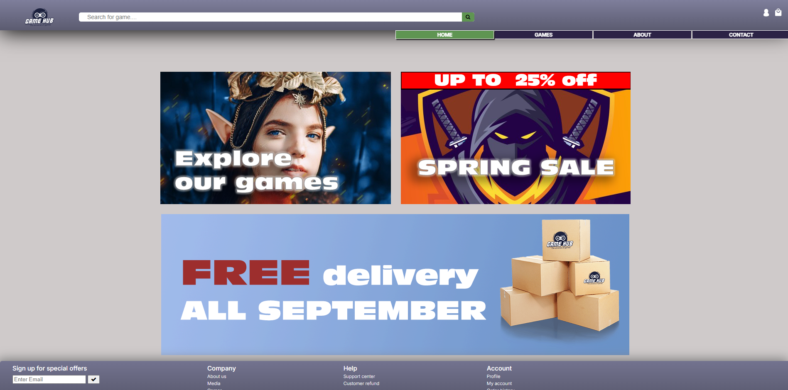

# Cross Course Project
## GameHub




Gamehub is a web site design to showcase a online game store. It fetched the game data from an API to display titles, pictures, descriptions and other details attatched to each game. This project was developed as part of several school assignemnt to demonstrate my skills in HTML, CSS and JavaScript. 

## Description

GameHub's purpose is to provide users with an intuitive and visually appealing designed platform for browsing and buying games. It has dynamic content rendering, responsive design and a nice user exerperience. 

### Features:

- **API integration/dynamic rendering:** Fetch all game data from an external API, and displaying it dynamically on the site.
- **Responsive design:** Optimized for both desktop and mobile devices
- **Interactive UI:** includes category filtering
- **Basket:** add items to basket and check out
- **Contact form:** contact the store, using the contact form 
  

## Built With

You can list a the tech stack that you've used over here

- [HTML5](https://developer.mozilla.org/en-US/docs/Web/HTML) - Used for content structure
- [CSS3](https://developer.mozilla.org/en-US/docs/Web/CSS) - Used for styling 
- [JavaScript](https://developer.mozilla.org/en-US/docs/Web/JavaScript) - used creating a burgermenu

## Getting Started

### Installing

To run locally, follow following steps:

1. Clone the repo:

```
git clone https://github.com/Noroff-FEU-Assignments/cross-course-project-evrlong.git
```

3. Navigate to folder:

```
cd cross-course-project-evrlong.git
```

### Running

To open project:
- navigate to clone folder
- open index.html in your web browser

## Contributing

If you want to contribute, you can make som changes or add new features and submit a pull request for review- 

## Contact

If you want to get in touch you can reach me at:

[linkedIn](https://www.linkedin.com/in/erik-løkken-005384261)


## Acknowledgments

I like to aknowledge to everyone who have taken the time to provide feedbacks during the project. 
